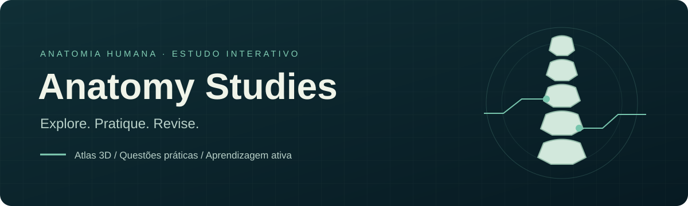

<div align="center">



# Anatomy Studies

**Explore anatomia em 3D. Pratique com peças virtuais. Aprenda com seus erros.**

Uma plataforma de estudo de anatomia humana em português, com atlas interativo,
questões práticas e revisão personalizada, direto no navegador.

[](https://github.com/HigorLoren/anatomy-studies/actions/workflows/ci.yml)


[Recursos](#recursos) · [Começar](#começar) · [Como estudar](#como-estudar) · [Desenvolvimento](#desenvolvimento) · [Contribuir](#contribuir)

</div>

## Por que este projeto?

Estudar anatomia exige mais do que memorizar nomes: é preciso reconhecer estruturas,
entender sua posição e identificá-las em diferentes ângulos. Anatomy Studies reúne
exploração livre e prática ativa em uma mesma experiência, com peças 3D que você pode
rotacionar, aproximar e investigar antes de voltar às questões.

## Recursos

| | O que você encontra |
| :--- | :--- |
| 🦴 **Atlas 3D interativo** | 12 visualizações-base de crânio, coluna, tórax, esqueleto, ossos dos membros e músculos. Selecione estruturas, consulte nomes e pinte peças. |
| 🎯 **Prática com peças virtuais** | Identifique estruturas numeradas ou denomine o alvo marcado com massinha azul ou bandeirinha. Explore ossos isolados e músculos com camadas de cobertura removíveis. |
| 📝 **151 questões** | Identificação, denominação, preenchimento de lacunas e diferenciação, incluindo um simulado de 70 questões e 36 questões complementares do roteiro da P1. |
| ⚙️ **Testes configuráveis** | Escolha regiões, tipos e quantidade de perguntas. O sorteio não repete questões e respeita a quantidade disponível. Cada teste vale 10 pontos. |
| 💬 **Correção com contexto** | Respostas corretas, incompletas e incorretas recebem feedback distinto, com explicações e o nome anatômico esperado. |
| 🔁 **Revisão dos erros** | Retome perguntas cuja última tentativa foi errada, incompleta ou “Não sei”. As questões com mais erros recebem prioridade. |
| 💾 **Progresso local** | Continue um teste interrompido e preserve seu histórico no mesmo navegador, usando `localStorage`. |
| 📱 **Layout responsivo** | Controles para mouse e toque, visualização em tela cheia e layout adaptado a celular, tablet e computador. |

### Da exploração à revisão

1. **Explore:** abra o atlas, escolha uma região e observe as estruturas por diferentes ângulos.
2. **Pratique:** consulte o banco de questões ou configure um teste com o conteúdo desejado.
3. **Confira:** receba feedback sobre a resposta e leia a explicação anatômica.
4. **Revise:** volte aos erros e acompanhe a evolução das suas tentativas.

## Começar

Você precisa de **Node.js 22.12 ou superior** e npm. Use um navegador moderno com suporte a WebGL.

```sh
git clone https://github.com/HigorLoren/anatomy-studies.git
cd anatomy-studies
npm ci
npm run dev
```

Abra o endereço informado pelo Vite no terminal, normalmente `http://localhost:5173`.
Os modelos GLB estão incluídos em `public/`; não é necessário preparar as peças para executar a aplicação.

Para gerar e conferir a versão de produção:

```sh
npm run build
npm run preview
```

O build é gerado em `dist/`. O comando `preview` serve essa versão localmente.

### Build legível separado

```sh
npm run build:readable
npm run preview:readable
```

Esse processo gera `dist-readable/`, separado do build padrão em `dist/`.
A minificação de JavaScript e CSS fica desativada, incluindo a otimização do
Tailwind, e os source maps são gerados para depuração. O bundler preserva os nomes
de funções e classes e não aplica encurtamento por minificação. Nomes podem receber
sufixos para resolver conflitos entre módulos; dependências já distribuídas com
nomes curtos mantêm seus nomes originais.

## Como estudar

- **Teste:** filtre o conteúdo por região e formato, escolha a quantidade e responda às questões sorteadas.
- **Prática livre:** abra qualquer pergunta do banco e navegue sem precisar terminar um teste.
- **Explorar 3D:** alterne modelos, peças e camadas; toque ou clique nas estruturas para consultar seus nomes.
- **Revisar meus erros:** use o histórico salvo para concentrar a prática nas perguntas que precisam de atenção.

A correção ignora diferenças de acentuação, capitalização, espaços extras e pontuação final.
Nomes anatômicos específicos ainda precisam estar completos: uma resposta incompleta recebe
feedback próprio e não conta como acerto. Abreviações como `M.` e `Mm.` são reconhecidas.

O progresso fica no navegador e dispositivo utilizados. Limpar os dados do site remove esse
histórico; se o armazenamento estiver bloqueado, o progresso permanece apenas na sessão.

## Desenvolvimento

A interface usa **Preact**, **TypeScript** e **Tailwind CSS**. O visualizador é construído
com **Babylon.js**, carrega modelos **glTF/GLB** e é empacotado com **Vite**.

| Comando | Finalidade |
| :--- | :--- |
| `npm run dev` | Iniciar o ambiente de desenvolvimento |
| `npm run lint` | Verificar o código com ESLint |
| `npm run typecheck` | Verificar os tipos TypeScript |
| `npm test` | Executar os testes de respostas, peças isoladas e modelos musculares |
| `npm run build` | Executar lint, checagem de tipos e gerar o build |
| `npm run preview` | Conferir o build localmente |

```text
src/
├── app/           # Estado, progresso e histórico de aprendizagem
├── components/    # Componentes da interface e controles do atlas
├── screens/       # Telas de exploração, questões e resultados
├── viewer/        # Câmera, materiais, peças e marcadores 3D
├── questions.ts   # Banco de questões e regras de correção
├── muscles.ts     # Alvos anatômicos e questões musculares
└── exploration.ts # Modelos, peças e camadas disponíveis
public/            # Modelos GLB e imagens
scripts/           # Preparação de modelos e testes
docs/              # Catálogo anatômico e documentação técnica
```

### Documentação

- [Guia de desenvolvimento](docs/guia-de-desenvolvimento.md): objetivos e formatos das atividades.
- [Catálogo de estruturas anatômicas](docs/catalogo-de-estruturas-anatomicas.md): escopo de conteúdo.
- [Questões de tórax e coluna](docs/perguntas-torax-coluna.md): banco escrito complementar.
- [Notas técnicas](docs/notas-tecnicas.md): preparação de modelos, marcadores, correção e comportamento do visualizador.
- [Como contribuir](CONTRIBUTING.md): fluxo de contribuição e validação.

## Contribuir

Sugestões de experiência de estudo, melhorias no visualizador e correções anatômicas são bem-vindas.
Abra uma [issue](https://github.com/HigorLoren/anatomy-studies/issues) descrevendo o problema
ou consulte o [guia de contribuição](CONTRIBUTING.md) antes de enviar um pull request.
Para correções de conteúdo, inclua uma referência anatômica verificável.

## Estado do projeto e uso dos materiais

Projeto em desenvolvimento, voltado ao estudo de anatomia. Nem todas as estruturas do
banco escrito possuem um alvo 3D individual; essas perguntas usam enunciados descritivos.
O conteúdo é educacional e não substitui orientação clínica.

Ainda não há licença de uso definida para o código neste repositório. Os modelos e demais
materiais também precisam ter sua origem e condições de redistribuição documentadas antes
de receber uma licença. A publicação no GitHub não concede automaticamente permissão de
reutilização desses arquivos.
